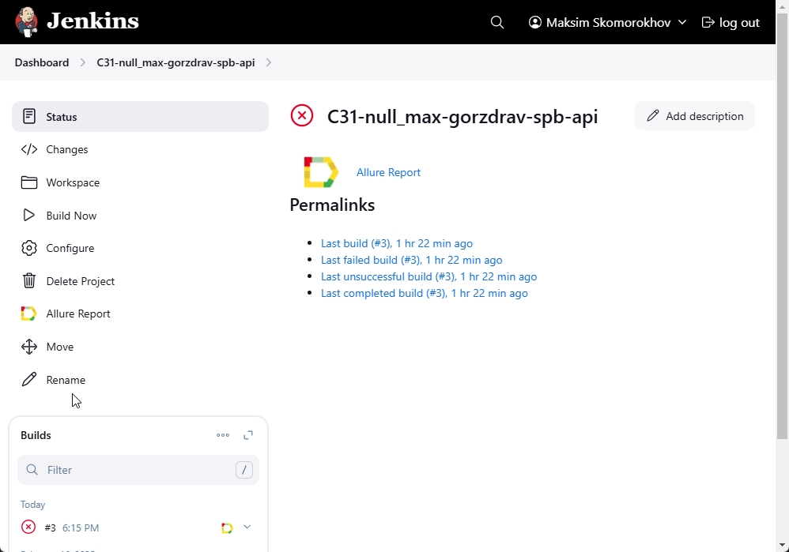
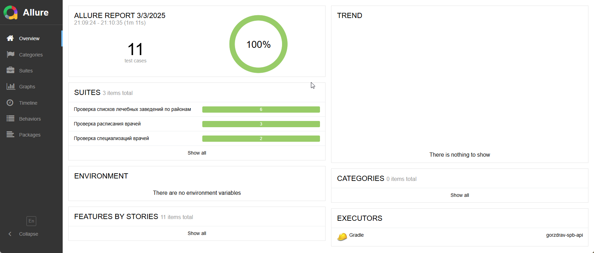
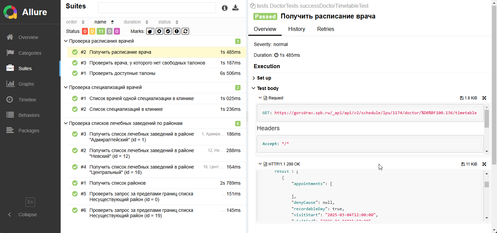
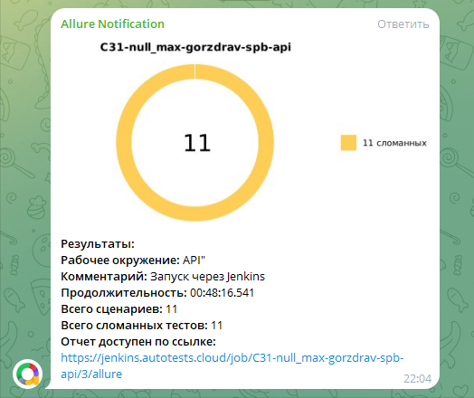

# Проект по автоматизации тестирования API для портала Здоровье Петербуржца


## :computer: Использованный стек технологий

<table align="center" border="0">
    <tr>
        <td align="center"><a href="https://www.java.com/" target="_blank"></a></td>
        <td align="center"><a href="https://www.jetbrains.com/idea/" target="_blank"></a></td>
        <td align="center"><a href="https://github.com/" target="_blank"></a></td>
        <td align="center"><a href="https://gradle.org/" target="_blank"></a></td>
        <td align="center"><a href="https://junit.org/junit5/" target="_blank"></a></td>
        <td align="center"><a href="https://rest-assured.io/" target="_blank"></a></td>
        <td align="center"><a href="https://www.jenkins.io/" target="_blank"></a></td>
        <td align="center"><a href="https://allurereport.org/" target="_blank"></a></td>
        <td align="center"><a href="https://telegram.org/" target="_blank"></a></td>
    </tr>
    <tr>
        <td align="center">Java</td>
        <td align="center">IntelliJ IDEA</td>
        <td align="center">GitHub</td>
        <td align="center">Gradle</td>
        <td align="center">JUnit 5</td>
        <td align="center">REST Assured</td>
        <td align="center">Jenkins</td>
        <td align="center">Allure Report</td>
        <td align="center">Telegram</td>
    </tr>
</table>

- Автотесты для данного проекта написаны на <code>Java</code> с использованием библиотеки <code>REST Assured</code> для взаимодействия с REST api.
- В качестве фреймворка для запуска тестов используется <code>Junit5</code>, а в качестве сборщика проекта - <code>Gradle</code>. Произведена настройка CI в <code>Jenkins</code>.
- По результатам каждого тестового прогона создаётся <code>Allure</code> отчёт для визуализации результатов прогона.
- После прогона тестов <code>Telegram</code> бот присылает сообщение с информацией о прошедшем прогоне

____

## 🤖 Примеры автоматизированных тест-кейсов
### Проверка списков лечебных заведений по районам
- ✅ Получить список районов
- ✅ Получить список лечебных заведений в районе (параметризованные тесты - Классы эквивалентности и граничные значения)

### Проверка специализаций врачей
- ✅ Список специализаций в клинике
- ✅ Список врачей одной специализации в клинике

### Проверка расписания врачей
- ✅ Получить расписание врача
- ✅ Проверить доступные талоны
- ✅ Проверить врача, у которого нет свободных талонов
____

## :arrow_forward: Запуск автотестов

### Запуск тестов локально из терминала
При выполнении команды, данные тесты запустятся локально в IDE
```
gradle clean test
```

##  Сборка в Jenkins



____
##  Пример Allure-отчета
### Overview



### Результат выполнения теста



____

##  Уведомления в Telegram с использованием бота

После завершения сборки, бот созданный в <code>Telegram</code>, автоматически обрабатывает и отправляет сообщение с результатом.

<p align="center">

</p>


